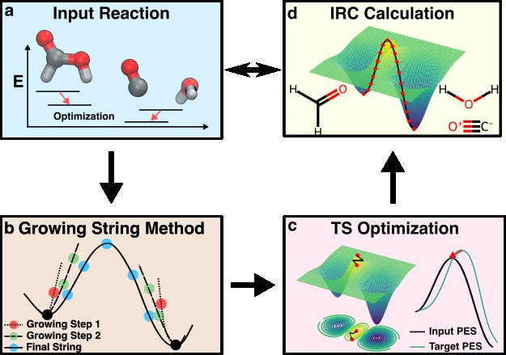

# ReactBench: Benchmarking MLIP Performance in Transition State Search on a Reactive Dataset

ReactBench is an automated transition state(TS) search workflow for benchmarking various MLIPs on a reactive dataset.
Through customizing new calculators or uploading new datasets, ReactBench can be used to evaluate the performance of different MLIPs in TS search.


## Project Structure

```
ReactBench/
├── README.md                    
├── config.yaml                 # Configuration file for running experiments
├── reactbench.jpg              # Workflow diagram image
├── ts1x.tar.gz                 # the whole Transition1x dataset
├── ckpt/                       # Checkpoint directory, files can be downloaded by hugging face.
├── data/                       # Sample reaction coordinate files in XYZ format.
└── ReactBench/                 # Main Python package
    ├── __init__.py            # Package initialization
    ├── main.py                # Main script.
    ├── main_functions.py      
    ├── gsm.py                 
    ├── pysis.py               
    ├── Calculators/           # MLIP calculator implementations
    │   ├── __init__.py        
    │   ├── leftnet.py         # LeftNet calculator.
    │   └── _utils.py          
    ├── utils/                  
    │   ├── __init__.py
    │   ├── parsers.py         
    │   ├── properties.py      
    │   ├── taffi_functions.py 
    │   ├── find_lewis.py      
    │   └── run_pygsm.py       
    └── MLIP/                   
        └── leftnet/           # LeftNet MLIP implementation
```

## Getting Started

### Installation Guide

```bash
git clone git@github.com:deepprinciple/ReactBench.git
cd ReactBench
conda create -n reactbench python=3.10
conda activate reactbench
conda install -y -c conda-forge openbabel

mkdir dependencies # install pysisyphus and pygsm
cd dependencies && git clone git@github.com:deepprinciple/pysisyphus.git && cd pysisyphus && git checkout reactbench 
pip install -e .
cd ..
git clone git@github.com:deepprinciple/pyGSM.git && cd pyGSM
pip install -e .
cd ../..

cd ReactBench/MLIP/leftnet/ # install leftnet env
pip install -e .
cd ../../..

pip install -r environment.txt
```


### Usage

1. First, test if the environment is properly set up by running sample data with LEFTNet calculator:

Download the LeftNet checkpoint from [hugging face](https://huggingface.co/yhong55/ReactBench/tree/main) and place it in the `ckpt` folder.

run `python ReactBench main.py config.yaml`. 


2. To test other MLIPs, you can create your own calculator by following these steps:

   a. Go to `ReactBench/Calculators` directory
   b. Use `leftnet` calculator as a reference implementation
   c. Create a new calculator class for your MLIP of interest
   d. Update `__init__.py` to register your new calculator
   e. Modify the `calc` parameter in `config.yaml` to use your calculator